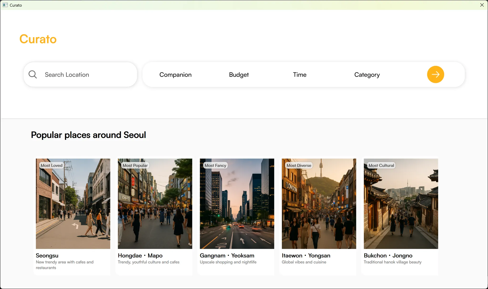
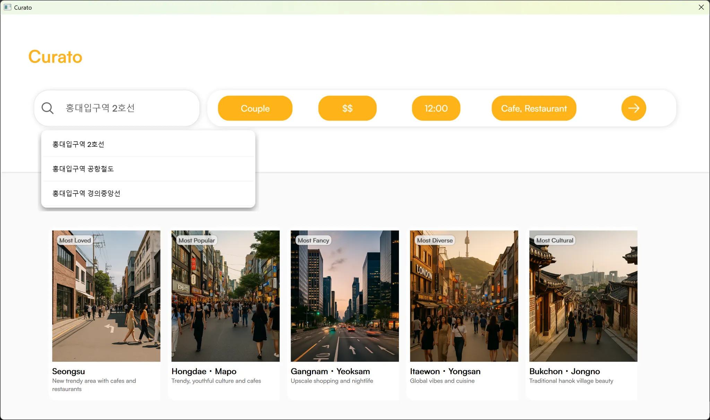
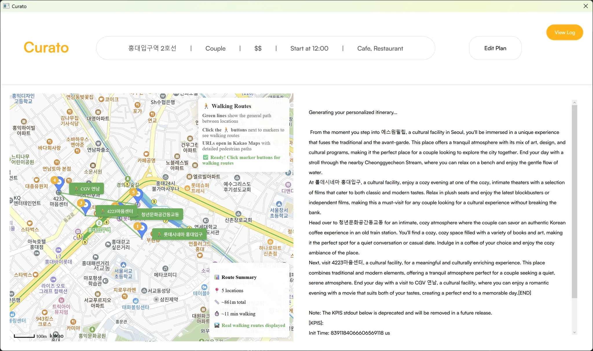
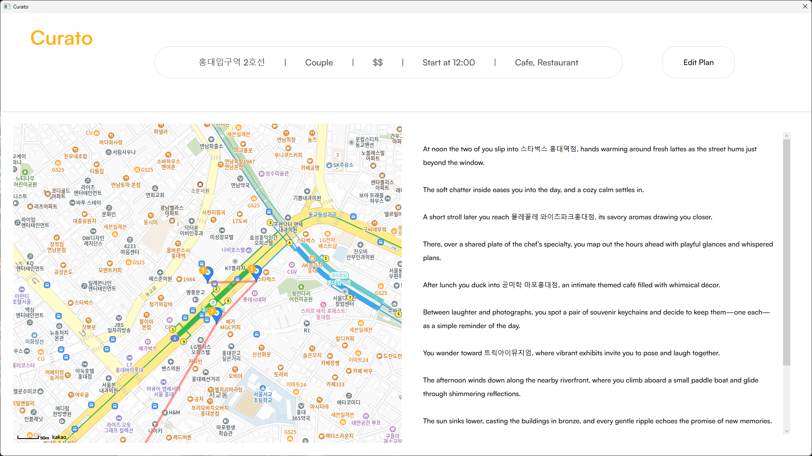

# Curato: Edge AI Itinerary Planner

Curato delivers a real-time itinerary planning solution that generates **personalized, unique day plans** based on real-world constraints including location, time, companion, and budget — all operating entirely on-device using quantized LLMs on Snapdragon® X Elite.

Curato streamlines the **decision-making process**, intelligently selecting optimal routes and venues with emotional context — and delivering comprehensive narrative-style plans that feel human.

> **All AI inference is performed locally**, without offloading any computation to the cloud. This ensures **data privacy**, **ultra-low latency**, and true spontaneity — even in low-connectivity environments.

Built with a single, highly optimized quantized LLM, Curato **executes complex tasks through specialized workflows** to balance efficiency and quality. It employs **dynamic prompt generation** based on real-time user inputs and **locally caches location data** to minimize unnecessary network calls.

Each prompt is dynamically crafted based on user preferences including location, time, and companion, enabling the LLM to respond with high contextual accuracy and deliver uniquely tailored plans with every generation.

---

## Edge AI Architecture & Performance

Curato employs a **revolutionary single-model architecture** designed specifically for real-time, on-device itinerary generation using the **Snapdragon X Elite's NPU** via **Qualcomm's Genie SDK**.

### **Core Architecture**
- **Qwen2.5‑7B‑Instruct** (quantized): Single model handling both place selection and narrative generation through specialized task splitting
- **Dual-Workflow Design**: Sequential processing of place selection (4-5 optimal locations from 20 candidates) and narrative generation (emotionally engaging daily stories)
- **Unified Context**: Shared understanding across both tasks ensures consistency and coherence

### **Infrastructure & Optimizations**
- **Smart Caching**: TTL-based caching with automatic cleanup and size management
- **Rate Limiting**: Sophisticated API rate limiting with automatic fallbacks
- **Place Management**: Intelligent selection based on companion type, budget, and time constraints
- **Dynamic Prompting**: Context-aware prompt generation adapting to real-time user inputs
- **Local Processing**: All AI inference executed on-device for privacy and performance

---

## Privacy & Trust

While Curato does not process government IDs, credit cards, or health records, privacy remains a core concern due to the nature of the data it handles. Planning an itinerary with Curato involves sharing deeply personal context, such as:
- Real-time location and movement patterns
- Companion or relationship dynamics (e.g., "I'm with my girlfriend")
- Budget constraints and spending preferences
- Time availability and scheduling patterns
- Emotional state and social context preferences

Although this information is not traditionally classified as "sensitive," it can reveal:
- **Intent and habits** that could be leveraged for targeted advertising
- **Behavioral profiles** based on your routines and preferences
- **Social and emotional context** that could be inferred for profiling or social analysis

In most cloud-based AI services, this data is transmitted to external servers for processing, where it could be aggregated and analyzed for advertising, profiling, or social inferencing purposes.

Curato takes a fundamentally different approach: all reasoning and generation are performed entirely on-device. This ensures that your personal context never leaves your device, providing:
- **True privacy** for your spontaneous decisions and daily routines
- **Offline functionality** in low-connectivity environments
- **Higher trust** in emotionally sensitive or private situations
- **Data sovereignty** — your information remains under your control at all times

By keeping all processing local, Curato protects not just your official data, but also the personal context that defines your experiences.

---

## Why Edge AI?

Curato is specifically architected for on-device execution to meet the demands of real-time, privacy-sensitive, and network-independent itinerary planning. Rather than relying on external cloud infrastructure, all AI reasoning, including location selection, context-aware ordering, and narrative generation, is executed locally using a single, optimized quantized language model.

### **Technical Advantages**
- **Ultra-low latency**: Inference executed directly on device, enabling immediate response to user input
- **Privacy preservation**: Sensitive user context processed entirely on-device, preventing PII exposure
- **Offline readiness**: Cached place data allows operation in low-connectivity environments
- **Energy efficiency**: Quantized model on Snapdragon NPU optimizes for performance and power
- **Robustness**: No cloud dependencies ensure consistent availability and reduced operational risk

### **User Experience Benefits**
- **Instant responses** without waiting for cloud processing
- **True spontaneity** - plan changes anywhere, anytime
- **Network independence** - works in subways, rural areas, or during connectivity issues
- **Personalization** - learns from your preferences without sharing data externally

Edge AI enables Curato to function as a trusted, context-aware assistant that delivers personalized itineraries securely and responsively—regardless of network conditions.

---

## Key Features

| Component                      | Description | Technical Innovation |
|-------------------------------|-------------|---------------------|
| **Single-Model Architecture**   | Qwen2.5-7B handles both place selection and narrative generation | Unified model with specialized task processing |
| **Smart Caching System**       | TTL-based caching with automatic cleanup and size management | Reduced API calls and improved responsiveness |
| **Intelligent Place Selection** | AI-powered selection from 20 candidates considering companion type and budget | Context-aware decision making |
| **Dynamic Prompt Generation**   | Real-time prompt crafting based on user context and preferences | Personalized AI responses |
| **Rate Limiting & API Management** | Sophisticated rate limiting with automatic fallbacks | Respectful API usage and reliability |
| **On-Device AI Inference**     | Quantized LLM running locally via Genie SDK | Privacy and performance optimization |
| **Real-time KakaoMap Integration** | Embedded WebView with intelligent location markers | Seamless user experience |
| **Secure API Key Handling**    | Environment-based configuration with encrypted injection | Production-ready security |

---

## Performance Benchmarks

Our optimized Qwen-Qwen pipeline demonstrates significant performance improvements over the original Phi-Qwen approach, achieving **78% faster** overall execution time.

### **Pipeline Performance Comparison**

#### **Place Selection Performance**

| Metric | Phi-Qwen Pipeline | Qwen-Qwen Pipeline | Performance Gain |
|--------|------------------|-------------------|------------------|
| Init Time (s) | 5.97 | 7.98 | -34% (slower init) |
| Prompt Tokens | 790 | 469 | +69% (more efficient) |
| Prompt Proc. Rate (tok/s) | 554 | **688.7** | **+24% faster** |
| Time to First Token (s) | 1.43 | **0.68** | **+52% faster** |
| Generated Tokens | 403 | 203 | +98% (more output) |
| Decode Rate (tok/s) | 2.2 | **12.84** | **+484% faster** |
| Decode Time (s) | 182.3 | **15.81** | **+91% faster** |
| **Total Query Time (s)** | **183.7** | **16.49** | **+91% faster** |

#### **Narrative Generation Performance**

| Metric | Phi-Qwen Pipeline | Qwen-Qwen Pipeline | Performance Gain |
|--------|------------------|-------------------|------------------|
| Init Time (s) | 9.28 | **7.86** | **+18% faster** |
| Prompt Tokens | 236 | 234 | +1% (similar) |
| Prompt Proc. Rate (tok/s) | 699 | 694.4 | -1% (similar) |
| Time to First Token (s) | 0.34 | 0.34 | 0% (identical) |
| Generated Tokens | 648 | 432 | +50% (more output) |
| Decode Rate (tok/s) | 12.5 | **12.83** | +3% (slightly faster) |
| Decode Time (s) | 51.8 | **33.67** | **+35% faster** |
| **Total Query Time (s)** | **52.1** | **34.01** | **+35% faster** |

#### **Overall Pipeline Results**

| Metric | Phi-Qwen Pipeline | Qwen-Qwen Pipeline | Improvement |
|--------|------------------|-------------------|-------------|
| **Total Execution Time (s)** | **235.8** | **50.5** | **+78% faster** |
| **User Experience** | 4-minute response | **Sub-minute response** | **4.7x faster** |

### **Performance Highlights**
- **Place Selection**: 91% faster execution (16.5s vs 183.7s)
- **Token Generation**: 484% faster decode rate (12.84 vs 2.2 tok/s)
- **User Experience**: 4.7x faster response time for complete itinerary generation
- **Architecture Benefits**: Single model instance eliminates switching overhead and reduces memory footprint

### **Test Environment**
- **Hardware**: Snapdragon X Elite Development Kit
- **Software**: Windows on Snapdragon, QAIRT SDK 2.34.2.250528164111_119506
- **Models**: Quantized 8-bit versions optimized for NPU execution

### **CPU vs. NPU Performance Comparison**

Our testing demonstrates that NPU acceleration is essential for our edge AI solution - CPU processing completely failed due to hardware limitations.

**Testing Results**:

| Processing Method | Overall Pipeline | System Stability |
|------------------|------------------|------------------|
| **CPU Processing** | ❌ **Failed** | ❌ **System Slowdown** |
| **NPU Processing** | ✅ **50.5s** | ✅ **Stable Performance** |

**Key Findings**:
- **CPU Failure**: Attempting to run our 7B parameter model on CPU resulted in complete failure - the system became unresponsive and could not complete any AI inference tasks
- **System Issues**: CPU processing caused significant slowdowns, making the entire PC nearly unusable during AI workload execution
- **NPU Success**: Only NPU acceleration enabled successful execution with stable system performance

**Why This Matters**:
Our edge AI solution absolutely requires NPU acceleration - CPU processing is not viable. This demonstrates why specialized AI hardware is essential for on-device AI applications. The NPU isn't just an optimization - it's a requirement for our application to function at all.

---

## Technical Implementation

### **Core Architecture Components**
- **`core/cache_manager.py`**: Intelligent caching with TTL and size management
- **`core/rate_limiter.py`**: Sophisticated API rate limiting (100 calls/minute)
- **`core/place_manager.py`**: Smart place type selection and collection
- **`core/prompts.py`**: Dynamic prompt generation for different AI tasks
- **`models/genie_runner.py`**: Unified interface for Genie SDK model execution

### **Advanced Features**
- **Automatic Path Detection**: Smart bundle path detection across platforms
- **Environment Variable Support**: Production-ready configuration management
- **Cross-Platform Compatibility**: Windows, macOS, and Linux support
- **Progress Callbacks**: Real-time UI feedback during AI processing
- **Error Handling**: Comprehensive fallback mechanisms and graceful degradation

### **Performance Optimizations**
- **Model Quantization**: 8-bit quantization for optimal NPU performance
- **Batch Processing**: Efficient API calls with intelligent result aggregation
- **Memory Management**: Automatic cache cleanup and size optimization
- **Task Specialization**: Optimized prompts for different processing stages

---

## Team Members

| Name | Role | Email | Qualcomm ID |
|------|------|-------|-------------|
| Sungwoo Jeon | AI Engineer / Fullstack Dev | [sungwoo100604@email.com] | [sungwoo100604@gmail.com] |
| Gain Lee | UI/UX Designer | [gain20570000@gmail.com] | [gain20570000@gmail.com] |

---

## Installation

> ⚠️ **Requires Windows on Snapdragon (Snapdragon X Elite)**

For detailed setup instructions, please refer to **[SETUP.md](./SETUP.md)** which provides comprehensive installation steps.

### **Quick Start Overview**
1. **Prerequisites**: Install .NET SDK 7.0+, Python 3.10, Git, and QAIRT SDK 2.28.0+
2. **Python Environment**: Create virtual environment and install required packages
3. **Install Dependencies**: Install required Python packages including cryptography for API key security
4. **API Key Setup**: Configure and decrypt your API keys for secure access
5. **Model Export**: Export quantized LLM using AI Hub Models
6. **Configuration**: Set up secure API keys and model bundle paths
7. **Build & Run**: Execute the WPF application

> **📖 For detailed step-by-step setup instructions, including Python dependencies, API key configuration, and model export, see [SETUP.md](./SETUP.md)**

### **Key Dependencies**
- **QAIRT SDK**: Qualcomm's AI Runtime for NPU execution
- **Genie SDK**: Bundled with QAIRT for model inference
- **qai-hub-models**: Model export and compilation tools
- **Kakao Map API**: Location services and place data

---

## Usage

### **Input Interface**
Upon launch, the application presents the main input interface (`SearchPage.xaml`), where users are guided to enter key trip parameters:

- **Starting location** — Korean or English input with Kakao keyword search and autocomplete  
- **Companion type** — Family, Friends, Partner, or Solo  
- **Budget** — Low, Medium, or High  
- **Start time** — Time periods and specific hour slots 
- **Preferred place types** — Multi-selection from predefined tags  

### **Enhanced User Experience**
- **Smart Autocomplete**: Debounced Kakao Map API integration with intelligent suggestions
- **Preset Regions**: Five popular preset regions for quick selection
- **Real-time Validation**: Instant feedback on input parameters
- **Progress Tracking**: Visual progress indicators during AI processing

### **AI-Powered Planning Process**
1. **Intelligent Place Collection**: Collects 10-15 places per category within walking distance
2. **Smart Candidate Reduction**: Reduces to 20 diverse candidates ensuring variety
3. **AI-Powered Selection**: Qwen model selects 4-5 optimal places considering context
4. **Narrative Generation**: Same model creates emotionally engaging daily story
5. **Route Optimization**: Intelligent ordering for optimal flow and experience

### **Output Interface**
Once inference is complete, the application transitions to the output interface (`OutputPage.xaml`), displaying:
- **Interactive Kakao Map** with four markers arranged in optimal visit order  
- **Generated Daily Narrative** with emotional context and personalization  
- **Input Summary** showing user preferences and constraints  
- **Edit Functionality** for plan regeneration and refinement  

---

## Screenshots & Demo

[Youtube Demo](https://www.youtube.com/watch?v=SLvkNsRBMl0)

#### 1. Input Interface (Search Page)
Shows the user's search flow, companion/budget/time selection, and suggested areas.

#### 2. Autocomplete in Action
Location search with debounced Kakao Map API keyword recommendations.

#### 3. Loading Animation
On-device inference in progress after clicking the Generate button.

#### 4. Output Interface (Map + Narrative)
Curato displays a generated emotional story and Kakao map with visit order.

#### 5. Interactive Features
When the user clicks on a generated place, Curato opens a Kakao map displaying the walking route.

---

## License

This project is licensed under the [MIT License](./LICENSE).

---

## Open Source Dependencies

Curato utilizes the following open-source tools and models:

- **[Kakao Map API](https://developers.kakao.com/docs/latest/en/local/dev-guide)** – Provides geocoding and keyword search functionality via REST endpoints  
- **[QAIRT SDK](https://docs.qualcomm.com/bundle/publicresource/topics/80-70017-15B/qairt-install.html)** – Qualcomm's AI Runtime SDK, required for running quantized LLMs on Snapdragon devices  
- **[Qwen2.5‑7B‑Instruct](https://aihub.qualcomm.com/models/qwen2_5_7b_instruct)** – Alibaba's instruction-tuned Qwen 2.5 model, optimized and quantized for on‑device use via Genie SDK

---

## Future Enhancements

- **Multi-language Support**: Korean and English interface with localized place recommendations
- **Advanced Route Optimization**: Integration with real-time traffic and public transport data
- **Personalization Learning**: User preference learning while maintaining privacy
- **Offline Mode**: Complete offline functionality with pre-cached popular locations
- **Social Features**: Share and discover itineraries while maintaining privacy
