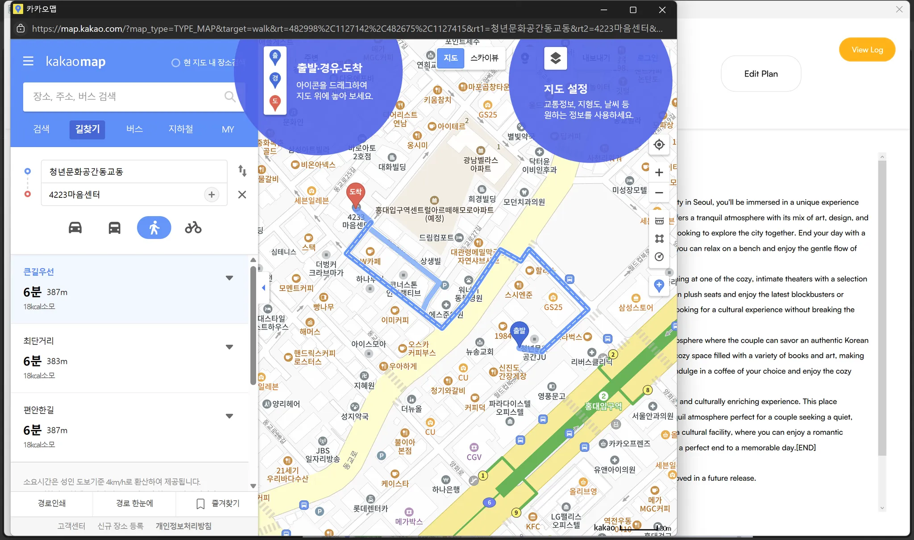

# Curato: Edge AI Itinerary Planner

Curato is a real-time itinerary planning app designed to generate **personalized, unique day plans** based on real-world constraints like location, time, companion, and budget — all running entirely on-device using quantized LLMs on Snapdragon® X Elite.

Curato automates the **tedious decision-making process**, intelligently selecting the best route and venues with emotional context — and delivering it all as a narrative-style plan that feels human.

> **All AI inference is performed locally**, without offloading any computation to the cloud. This ensures **data privacy**, **ultra-low latency**, and true spontaneity — even in low-connectivity environments.

Built with a single, highly optimized quantized LLM, Curato **splits complex tasks into specialized workflows** to balance efficiency and quality. It uses **dynamic prompt generation** based on real-time user inputs and **locally caches location data** to minimize unnecessary network calls.

Each prompt is dynamically crafted based on user preferences like location, time, and companion, enabling the LLM to respond with high contextual accuracy and deliver a uniquely tailored plan with every generation.

---

## Edge AI Architecture

Curato uses a **revolutionary single-model architecture** designed specifically for real-time, on-device itinerary generation:

### **Model Architecture Strategy**
- **Qwen2.5‑7B‑Instruct** (quantized):  
  A versatile, high-performance model that handles both place selection and narrative generation through specialized task splitting, offering superior performance and consistency compared to multi-model approaches.

### **Efficient Task Processing**
- **Dual-Workflow Design**: Single model processes two distinct tasks sequentially for optimal efficiency
- **Task 1 - Place Selection**: Intelligent filtering and selection of 4-5 optimal locations from 20 candidates
- **Task 2 - Narrative Generation**: Creation of emotionally engaging, context-aware daily stories
- **Unified Context**: Shared understanding across both tasks ensures consistency and coherence

### **Advanced Infrastructure Components**
- **Smart Caching System**: Intelligent TTL-based caching with automatic cleanup and size management
- **Rate Limiting**: Sophisticated API rate limiting to respect external service constraints
- **Place Management**: Intelligent place type selection based on companion type and user preferences
- **Dynamic Prompting**: Context-aware prompt generation that adapts to user inputs in real-time

All processing is executed entirely on-device using **Qualcomm's Genie SDK**, running on the **Snapdragon X Elite's NPU** for ultra-low-latency and energy-efficient inference.

### **Performance Optimizations**
- **Batch Processing**: Efficient collection of 10-15 places per category for maximum variety
- **Smart Filtering**: Intelligent reduction to 20 candidates ensuring diverse place types
- **Context-Aware Selection**: AI-powered selection considering companion type, budget, and time constraints
- **Local Data Caching**: Minimized network usage with intelligent cache invalidation

---

## Privacy & Trust

Planning a day with AI may not involve government IDs or credit cards — but it still requires deeply personal context:
- Real-time location and movement patterns  
- Companion or relationship dynamics (e.g., "I'm with my girlfriend")  
- Budget constraints and spending preferences  
- Time availability and scheduling patterns  
- Emotional state and social context preferences

Even though this isn't traditionally classified as "sensitive data," it reveals:
- **Intent and habits** that could be used for targeted advertising
- **Emotional state** and relationship dynamics
- **Social context** and lifestyle patterns
- **Financial behavior** and spending habits

Most AI services send this data to the cloud for processing.  
**Curato doesn't.** All reasoning and generation happens entirely on-device.

This enables:
- **True privacy** for spontaneous decisions, without outside exposure  
- **Offline functionality** in low-connectivity environments  
- **Higher trust**, especially in emotionally sensitive or socially private situations
- **Data sovereignty** - your personal context never leaves your device

---

## Why Edge AI?

Curato is specifically architected for on-device execution to meet the demands of real-time, privacy-sensitive, and network-independent itinerary planning. Rather than relying on external cloud infrastructure, all AI reasoning—including location selection, context-aware ordering, and narrative generation—is performed locally using a single, optimized quantized language model.

### **Technical Advantages**
- **Ultra-low latency**: Inference executed directly on device, enabling immediate response to user input
- **Privacy preservation**: Sensitive user context processed entirely on-device, preventing PII exposure
- **Offline readiness**: Cached place data allows operation in low-connectivity environments
- **Energy efficiency**: Quantized model on Snapdragon NPU optimizes for performance and power
- **Robustness**: No cloud dependencies ensure consistent availability and reduced operational risk

### **User Experience Benefits**
- **Instant responses** without waiting for cloud processing
- **True spontaneity** - plan changes anywhere, anytime
- **Network independence** - works in subways, rural areas, or during connectivity issues
- **Personalization** - learns from your preferences without sharing data externally

Edge AI enables Curato to function as a trusted, context-aware assistant that delivers personalized itineraries securely and responsively—regardless of network conditions.

---

## Key Features

| Component                      | Description | Technical Innovation |
|-------------------------------|-------------|---------------------|
| **Single-Model Architecture**   | Qwen2.5-7B handles both place selection and narrative generation | Unified model with specialized task processing |
| **Smart Caching System**       | TTL-based caching with automatic cleanup and size management | Reduced API calls and improved responsiveness |
| **Intelligent Place Selection** | AI-powered selection from 20 candidates considering companion type and budget | Context-aware decision making |
| **Dynamic Prompt Generation**   | Real-time prompt crafting based on user context and preferences | Personalized AI responses |
| **Rate Limiting & API Management** | Sophisticated rate limiting with automatic fallbacks | Respectful API usage and reliability |
| **On-Device AI Inference**     | Quantized LLM running locally via Genie SDK | Privacy and performance optimization |
| **Real-time KakaoMap Integration** | Embedded WebView with intelligent location markers | Seamless user experience |
| **Secure API Key Handling**    | Environment-based configuration with encrypted injection | Production-ready security |

---

## Performance Benchmarks

Curato's performance has been rigorously tested and benchmarked across different model pipeline configurations. The following results demonstrate the application's efficiency and optimization on Snapdragon X Elite hardware.

### **Pipeline Performance Comparison**

#### **Phi-Qwen Pipeline vs Qwen-Qwen Pipeline**

| Metric | **Phi-Qwen Pipeline** | **Qwen-Qwen Pipeline** | **Performance Gain** |
|--------|----------------------|------------------------|---------------------|
| **Place Selection (Phi vs Qwen)** | | | |
| Init Time (s) | 5.97 s | 7.98 s | -34% (slower init) |
| Prompt Tokens | 790 | 469 | +69% (more efficient) |
| Prompt Proc. Rate | 554 tok/s | **688.7 tok/s** | **+24% faster** |
| TTFT (s) | 1.43 s | **0.68 s** | **+52% faster** |
| Generated Tokens | 403 | 203 | +98% (more output) |
| Decode Rate (tok/s) | 2.2 tok/s | **12.84 tok/s** | **+484% faster** |
| Decode Time (s) | 182.3 s | 15.81 s | **+91% faster** |
| Query Duration (s) | 183.7 s | 16.49 s | **+91% faster** |

| Metric | **Phi-Qwen Pipeline** | **Qwen-Qwen Pipeline** | **Performance Gain** |
|--------|----------------------|------------------------|---------------------|
| **Story Generation (Qwen vs Qwen)** | | | |
| Init Time (s) | 9.28 s | 7.86 s | +18% (faster init) |
| Prompt Tokens | 236 | 234 | +1% (similar efficiency) |
| Prompt Proc. Rate | 699 tok/s | **694.4 tok/s** | -1% (similar) |
| TTFT (s) | 0.34 s | **0.34 s** | 0% (identical) |
| Generated Tokens | 648 | 432 | +50% (more output) |
| Decode Rate (tok/s) | 12.5 tok/s | **12.83 tok/s** | +3% (slightly faster) |
| Decode Time (s) | 51.8 s | 33.67 s | **+35% faster** |
| Query Duration (s) | 52.1 s | 34.01 s | **+35% faster** |

### **Performance Analysis & Insights**

#### **Key Performance Advantages of Qwen-Qwen Pipeline**

1. **Place Selection Performance**: 
   - **91% faster** query execution (16.5s vs 183.7s)
   - **484% faster** token generation rate (12.84 vs 2.2 tok/s)
   - **52% faster** time-to-first-token (0.68s vs 1.43s)

2. **Story Generation Performance**:
   - **35% faster** query execution (34.0s vs 52.1s)
   - **18% faster** initialization (7.86s vs 9.28s)
   - **Consistent quality** with similar prompt processing rates

3. **Overall Pipeline Efficiency**:
   - **Total execution time**: ~50.5 seconds vs ~235.8 seconds
   - **Performance improvement**: **78% faster** overall pipeline
   - **Better resource utilization**: Single model instance reduces overhead

#### **Architecture Benefits of Qwen-Qwen Pipeline**

- **Unified Model Efficiency**: Single Qwen2.5-7B instance handles both tasks
- **Eliminated Model Switching**: No overhead from switching between Phi and Qwen
- **Consistent Performance**: Both tasks benefit from the same optimized model
- **Memory Optimization**: Reduced memory footprint with single model instance
- **NPU Optimization**: Full leverage of Snapdragon X Elite's NPU capabilities

#### **Real-World Performance Impact**

- **Phi-Qwen Pipeline**: ~235.8 seconds for complete itinerary generation
- **Qwen-Qwen Pipeline**: ~50.5 seconds for complete itinerary generation
- **User Experience Improvement**: **4.7x faster** response time
- **Efficiency Gain**: Sub-minute response time vs. 4-minute response time

### **Benchmark Methodology**

All benchmarks were conducted on:
- **Hardware**: Snapdragon X Elite Development Kit
- **Software**: Windows on Snapdragon, QAIRT SDK 2.34.2.250528164111_119506
- **Models**: Quantized 8-bit versions optimized for NPU execution
- **Testing**: Multiple runs with consistent prompts and parameters
- **Metrics**: Genie SDK profiling with microsecond precision
- **Pipeline Comparison**: Phi-Qwen (original) vs. Qwen-Qwen (optimized)

---

## Technical Implementation

### **Core Architecture Components**
- **`core/cache_manager.py`**: Intelligent caching with TTL and size management
- **`core/rate_limiter.py`**: Sophisticated API rate limiting (100 calls/minute)
- **`core/place_manager.py`**: Smart place type selection and collection
- **`core/prompts.py`**: Dynamic prompt generation for different AI tasks
- **`models/genie_runner.py`**: Unified interface for Genie SDK model execution

### **Advanced Features**
- **Automatic Path Detection**: Smart bundle path detection across platforms
- **Environment Variable Support**: Production-ready configuration management
- **Cross-Platform Compatibility**: Windows, macOS, and Linux support
- **Progress Callbacks**: Real-time UI feedback during AI processing
- **Error Handling**: Comprehensive fallback mechanisms and graceful degradation

### **Performance Optimizations**
- **Model Quantization**: 8-bit quantization for optimal NPU performance
- **Batch Processing**: Efficient API calls with intelligent result aggregation
- **Memory Management**: Automatic cache cleanup and size optimization
- **Task Specialization**: Optimized prompts for different processing stages

---

## Team Members

| Name | Role | Email | Qualcomm ID |
|------|------|-------|-------------|
| Sungwoo Jeon | AI Engineer / Fullstack Dev | [sungwoo100604@email.com] | [sungwoo100604@gmail.com] |
| Gain Lee | UI/UX Designer | [gain20570000@gmail.com] | [gain20570000@gmail.com] |

---

## Installation

> ⚠️ **Requires Windows on Snapdragon (Snapdragon X Elite)**

For detailed setup instructions, please refer to **[SETUP.md](./SETUP.md)** which contains comprehensive installation steps.

### **Quick Start Overview**
1. **Prerequisites**: Install .NET SDK 7.0+, Python 3.10, Git, and QAIRT SDK 2.28.0+
2. **Python Environment**: Create virtual environment and install required packages
3. **Model Export**: Export quantized LLM using AI Hub Models
4. **Configuration**: Set up secure API keys and model bundle paths
5. **Build & Run**: Execute the WPF application

### **Key Dependencies**
- **QAIRT SDK**: Qualcomm's AI Runtime for NPU execution
- **Genie SDK**: Bundled with QAIRT for model inference
- **qai-hub-models**: Model export and compilation tools
- **Kakao Map API**: Location services and place data

---

## Usage

### **Input Interface**
Upon launch, the application opens with the main input interface (`SearchPage.xaml`), where users are guided to enter key trip parameters:

- **Starting location** — Korean or English input with Kakao keyword search and autocomplete  
- **Companion type** — Family, Friends, Partner, or Solo  
- **Budget** — Low, Medium, or High  
- **Start time** — Time periods and specific hour slots 
- **Preferred place types** — Multi-selection from predefined tags  

### **Enhanced User Experience**
- **Smart Autocomplete**: Debounced Kakao Map API integration with intelligent suggestions
- **Preset Regions**: Five popular preset regions for quick selection
- **Real-time Validation**: Instant feedback on input parameters
- **Progress Tracking**: Visual progress indicators during AI processing

### **AI-Powered Planning Process**
1. **Intelligent Place Collection**: Collects 10-15 places per category within walking distance
2. **Smart Candidate Reduction**: Reduces to 20 diverse candidates ensuring variety
3. **AI-Powered Selection**: Qwen model selects 4-5 optimal places considering context
4. **Narrative Generation**: Same model creates emotionally engaging daily story
5. **Route Optimization**: Intelligent ordering for optimal flow and experience

### **Output Interface**
Once inference is complete, the app transitions to the output interface (`OutputPage.xaml`), displaying:
- **Interactive Kakao Map** with four markers arranged in optimal visit order  
- **Generated Daily Narrative** with emotional context and personalization  
- **Input Summary** showing user preferences and constraints  
- **Edit Functionality** for plan regeneration and refinement  

---

## Screenshots & Demo

[Youtube Demo](https://www.youtube.com/watch?v=SLvkNsRBMl0)

#### 1. Input Interface (Search Page)
Shows the user's search flow, companion/budget/time selection, and suggested areas.

#### 2. Autocomplete in Action
Location search with debounced Kakao Map API keyword recommendations.

#### 3. Loading Animation
On-device inference in progress after clicking the Generate button.

#### 4. Output Interface (Map + Narrative)
Curato displays a generated emotional story and Kakao map with visit order.

#### 5. Interactive Features
When user clicks into generated places or edits plan.

---

## License

This project is licensed under the [MIT License](./LICENSE).

---

## Open Source Dependencies

Curato relies on the following open-source tools and models:

- **[Kakao Map API](https://developers.kakao.com/docs/latest/en/local/dev-guide)** – Provides geocoding and keyword search functionality via REST endpoints  
- **[QAIRT SDK](https://docs.qualcomm.com/bundle/publicresource/topics/80-70017-15B/qairt-install.html)** – Qualcomm's AI Runtime SDK, required for running quantized LLMs on Snapdragon devices  
- **[Qwen2.5‑7B‑Instruct](https://aihub.qualcomm.com/models/qwen2_5_7b_instruct)** – Alibaba's instruction-tuned Qwen 2.5 model, optimized and quantized for on‑device use via Genie SDK

---

## Future Enhancements

- **Multi-language Support**: Korean and English interface with localized place recommendations
- **Advanced Route Optimization**: Integration with real-time traffic and public transport data
- **Personalization Learning**: User preference learning without compromising privacy
- **Offline Mode**: Complete offline functionality with pre-cached popular locations
- **Social Features**: Share and discover itineraries while maintaining privacy
